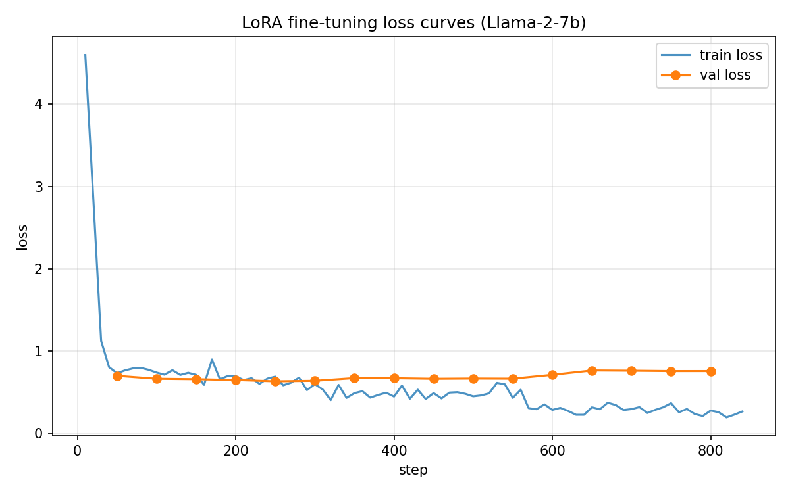

# Dataset Notes — Duplicate Analysis

## Summary
The provided dataset (`data/dataset.json`) contains **5000 science QA samples**. Upon inspection, **17 question texts appear twice** in the dataset, covering 34 rows (0.68% of the dataset). Before train/val splitting, I deduplicated by question text (keeping the first occurrence), leaving **4983 unique samples**.

## Breakdown of Duplicates

Of the 17 duplicated question texts:

**11 groups are exact duplicates** (identical question + identical answer). These are likely artifacts of the data collection process (e.g., the same source paragraph scraped twice):

| Row pair | Question (abbreviated) | Answer (both rows) |
|---|---|---|
| 26 / 3496 | Generating electric current with a magnetic field | `electromagnetic induction` |
| 90 / 4341 | Largest artery in the body | `aorta` |
| 140 / 3086 | First stage of cellular respiration | `glycolysis` |
| 506 / 4942 | Aging: cells lose their ability to do what | `divide` |
| 571 / 1078 | Used to write nuclear equations for radioactive decay | `nuclear symbols` |
| 1106 / 3685 | Plants release water vapor through their leaves | `transpiration` |
| 1221 / 3362 | In vascular plants, the sporophyte generation is what | `dominant` |
| 1456 / 3014 | Stage of life when a child becomes sexually mature | `puberty` |
| 1631 / 4187 | Most numerous and diverse biochemical compounds | `proteins` |
| 1903 / 3885 | Tiny sacs in the lungs where gas exchange takes place | `alveoli` |
| 3662 / 3773 | Maintaining a high metabolic rate takes a lot of what | `energy` |

**6 groups share the same question but have minor answer variations** — these appear to be different annotator phrasings of the same answer:

| Question (abbreviated) | Answer variant A | Answer variant B |
|---|---|---|
| First part of the large intestine | `cecum` | `the cecum` |
| Where are protons and neutrons located | `central nucleus` | `nucleus` |
| Main function of the cardiovascular system | `transporting substances around the body` | `to transport` |
| Simplest life cycle | `haploid` | `haploid life cycle` |
| Basic unit of matter | `atoms` | `atom` |
| Parent cell splits into two identical daughter cells | `binary fission` | `fission` |

## Motivation for Deduplication

If we did not deduplicate and split by index, a duplicated question could land in both the training set and the validation set, causing the model to effectively "memorize" the validation answer during training and artificially inflating validation accuracy. Deduplicating by question text (keeping the first occurrence) guarantees that no question string appears in both splits.

## Final Split

- Original: 5000 samples
- After deduplication: **4983 unique-question samples**
- Training set: 4484 samples (90%)
- Validation set: 499 samples (10%)
- Random seed: 42 (for reproducibility)

---

# Training Results & Iterative Improvement

## Round 1 — Baseline

### Hyperparameters

| Parameter | Value |
|---|---|
| LoRA rank (r) | 8 |
| LoRA alpha | 16 |
| LoRA dropout | 0.05 |
| Target modules | q_proj, k_proj, v_proj, o_proj |
| Trainable params | 8,388,608 (0.12% of 6.74B) |
| Epochs | 3 |
| Learning rate | 2e-4 |
| LR scheduler | cosine |
| Warmup ratio | 0.03 |
| Effective batch size | 16 (per_device=4 × grad_accum=4) |
| Precision | bf16 |
| Max seq length | 256 |
| Prompt template | `Question: {q}\nAnswer: {a}<eos>` |

### Results

| Metric | Value |
|---|---|
| Train accuracy | **62.1%** (2784 / 4484) |
| Val accuracy | **49.5%** (247 / 499) |
| Final train loss | ~0.25 |
| Best val loss | ~0.65 (around step 150–200) |
| Final val loss | ~0.75 |
| Training time | 13 min 34 sec (840 steps, single A6000 49GB) |

### Loss Curve

### Loss Curve Analysis

The training loss decreased steadily from 4.6 to ~0.25 over 840 steps (3 epochs). However, the validation loss plateaued at ~0.65 by step 150–200 (end of epoch 1) and began gradually increasing afterward, reaching ~0.75 by the end of training. This indicates **overfitting after approximately 1 epoch** — the model continued memorizing training examples without improving generalization.

### Error Analysis

Examining the validation set generations (`output/val_generations.json`) revealed three categories of errors:

**Category 1 — Semantically correct but substring mismatch (pred shorter than gold):**
The accuracy metric checks `gold.lower() in pred.lower()`. When the model produces a shorter but semantically equivalent answer, it is marked incorrect.

| Gold answer | Model prediction | Correct? |
|---|---|---|
| `electric charge` | `charge` | ❌ (gold ⊄ pred) |
| `warning predators` | `warning` | ❌ (gold ⊄ pred) |
| `in the tropics` | `tropical rainforests` | ❌ (different phrasing) |
| `vesicle transport` | `diffusion` | ❌ (genuinely wrong) |

**Category 2 — Semantically correct and substring match succeeds (pred longer than gold):**
These are counted as correct. Examples: `static` → `static electricity`, `theory` → `a theory`, `potential` → `potential energy`.

**Category 3 — Genuinely wrong answers:**
The model produces a factually incorrect response. Examples: `foundation` → `keystone`, `body cells` → `gametes`.

**Key insight:** Category 1 is the largest source of avoidable error. The model learned to produce minimal, telegraphic answers because the training target was a bare answer string (e.g., `amino`). Since the metric requires the gold answer to be a *substring* of the prediction, a longer prediction that contains the gold answer always matches, but a shorter prediction that drops part of the gold answer always fails.

### Diagnosis & Improvement Plan

Based on the loss curves and error analysis, four improvements are identified for Round 2:

| Issue | Root cause | Fix |
|---|---|---|
| Substring mismatch on short predictions | Bare-answer training target teaches the model to be too terse | Change prompt template to `Answer: The answer is {a}.` so predictions naturally contain the full gold string |
| Overfitting after epoch 1 | 3 epochs is too many for 4484 samples with r=8 | Reduce to 2 epochs |
| Limited model capacity per step | LoRA rank 8 may be too small to learn sufficient QA patterns within fewer epochs | Increase rank to 16, alpha to 32 (maintain alpha/r = 2) |
| Insufficient regularization | dropout=0.05 is light | Increase LoRA dropout to 0.1; reduce LR from 2e-4 to 1e-4 |

## Round 2 — Improved (planned)

| Parameter | Round 1 | Round 2 |
|---|---|---|
| Prompt template | `Question: {q}\nAnswer: {a}<eos>` | `Question: {q}\nAnswer: The answer is {a}.<eos>` |
| Epochs | 3 | **2** |
| LoRA rank (r) | 8 | **16** |
| LoRA alpha | 16 | **32** |
| LoRA dropout | 0.05 | **0.1** |
| Learning rate | 2e-4 | **1e-4** |

**Expected outcome:** Val accuracy 60–70%+ by reducing overfitting and aligning the generation style with the substring-match metric.
