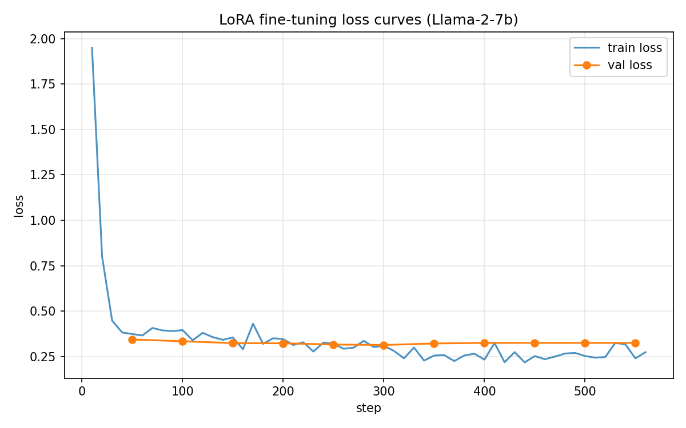

# Dataset Notes — Duplicate Analysis

## Summary
The provided dataset (`data/dataset.json`) contains **5000 science QA samples**. Upon inspection, **17 question texts appear twice** in the dataset, covering 34 rows (0.68% of the dataset). Before train/val splitting, I deduplicated by question text (keeping the first occurrence), leaving **4983 unique samples**.

## Breakdown of Duplicates

Of the 17 duplicated question texts:

**11 groups are exact duplicates** (identical question + identical answer). These are likely artifacts of the data collection process (e.g., the same source paragraph scraped twice):

| Row pair | Question (abbreviated) | Answer (both rows) |
|---|---|---|
| 26 / 3496 | Generating electric current with a magnetic field | `electromagnetic induction` |
| 90 / 4341 | Largest artery in the body | `aorta` |
| 140 / 3086 | First stage of cellular respiration | `glycolysis` |
| 506 / 4942 | Aging: cells lose their ability to do what | `divide` |
| 571 / 1078 | Used to write nuclear equations for radioactive decay | `nuclear symbols` |
| 1106 / 3685 | Plants release water vapor through their leaves | `transpiration` |
| 1221 / 3362 | In vascular plants, the sporophyte generation is what | `dominant` |
| 1456 / 3014 | Stage of life when a child becomes sexually mature | `puberty` |
| 1631 / 4187 | Most numerous and diverse biochemical compounds | `proteins` |
| 1903 / 3885 | Tiny sacs in the lungs where gas exchange takes place | `alveoli` |
| 3662 / 3773 | Maintaining a high metabolic rate takes a lot of what | `energy` |

**6 groups share the same question but have minor answer variations** — these appear to be different annotator phrasings of the same answer:

| Question (abbreviated) | Answer variant A | Answer variant B |
|---|---|---|
| First part of the large intestine | `cecum` | `the cecum` |
| Where are protons and neutrons located | `central nucleus` | `nucleus` |
| Main function of the cardiovascular system | `transporting substances around the body` | `to transport` |
| Simplest life cycle | `haploid` | `haploid life cycle` |
| Basic unit of matter | `atoms` | `atom` |
| Parent cell splits into two identical daughter cells | `binary fission` | `fission` |

## Motivation for Deduplication

If we did not deduplicate and split by index, a duplicated question could land in both the training set and the validation set, causing the model to effectively "memorize" the validation answer during training and artificially inflating validation accuracy. Deduplicating by question text (keeping the first occurrence) guarantees that no question string appears in both splits.

## Final Split

- Original: 5000 samples
- After deduplication: **4983 unique-question samples**
- Training set: 4484 samples (90%)
- Validation set: 499 samples (10%)
- Random seed: 42 (for reproducibility)

---

# Training Results & Iterative Improvement

## Round 1 — Baseline

### Hyperparameters

| Parameter | Value |
|---|---|
| LoRA rank (r) | 8 |
| LoRA alpha | 16 |
| LoRA dropout | 0.05 |
| Target modules | q_proj, k_proj, v_proj, o_proj |
| Trainable params | 8,388,608 (0.12% of 6.74B) |
| Epochs | 3 |
| Learning rate | 2e-4 |
| LR scheduler | cosine |
| Warmup ratio | 0.03 |
| Effective batch size | 16 (per_device=4 × grad_accum=4) |
| Precision | bf16 |
| Max seq length | 256 |
| Prompt template | `Question: {q}\nAnswer: {a}<eos>` |

### Results

| Metric | Value |
|---|---|
| Train accuracy | **62.1%** (2784 / 4484) |
| Val accuracy | **49.5%** (247 / 499) |
| Final train loss | ~0.25 |
| Best val loss | ~0.65 (around step 150–200) |
| Final val loss | ~0.75 |
| Training time | 13 min 34 sec (840 steps, single A6000 49GB) |

### Loss Curve

### Loss Curve Analysis

The training loss decreased steadily from 4.6 to ~0.25 over 840 steps (3 epochs). However, the validation loss plateaued at ~0.65 by step 150–200 (end of epoch 1) and began gradually increasing afterward, reaching ~0.75 by the end of training. This indicates **overfitting after approximately 1 epoch** — the model continued memorizing training examples without improving generalization.

### Error Analysis

Examining the validation set generations (`output/val_generations.json`) revealed three categories of errors:

**Category 1 — Semantically correct but substring mismatch (pred shorter than gold):**
The accuracy metric checks `gold.lower() in pred.lower()`. When the model produces a shorter but semantically equivalent answer, it is marked incorrect.

| Gold answer | Model prediction | Correct? |
|---|---|---|
| `electric charge` | `charge` | ❌ (gold ⊄ pred) |
| `warning predators` | `warning` | ❌ (gold ⊄ pred) |
| `in the tropics` | `tropical rainforests` | ❌ (different phrasing) |
| `vesicle transport` | `diffusion` | ❌ (genuinely wrong) |

**Category 2 — Semantically correct and substring match succeeds (pred longer than gold):**
These are counted as correct. Examples: `static` → `static electricity`, `theory` → `a theory`, `potential` → `potential energy`.

**Category 3 — Genuinely wrong answers:**
The model produces a factually incorrect response. Examples: `foundation` → `keystone`, `body cells` → `gametes`.

**Key insight:** Category 1 is the largest source of avoidable error. The model learned to produce minimal, telegraphic answers because the training target was a bare answer string (e.g., `amino`). Since the metric requires the gold answer to be a *substring* of the prediction, a longer prediction that contains the gold answer always matches, but a shorter prediction that drops part of the gold answer always fails.

### Diagnosis & Improvement Plan

Based on the loss curves and error analysis, four improvements are identified for Round 2:

| Issue | Root cause | Fix |
|---|---|---|
| Substring mismatch on short predictions | Bare-answer training target teaches the model to be too terse | Change prompt template to `Answer: The answer is {a}.` so predictions naturally contain the full gold string |
| Overfitting after epoch 1 | 3 epochs is too many for 4484 samples with r=8 | Reduce to 2 epochs |
| Limited model capacity per step | LoRA rank 8 may be too small to learn sufficient QA patterns within fewer epochs | Increase rank to 16, alpha to 32 (maintain alpha/r = 2) |
| Insufficient regularization | dropout=0.05 is light | Increase LoRA dropout to 0.1; reduce LR from 2e-4 to 1e-4 |

## Round 2 — Prompt Template + Regularization

### Changes from Round 1

| Parameter | Round 1 | Round 2 |
|---|---|---|
| Prompt template | `Question: {q}\nAnswer: {a}<eos>` | `Question: {q}\nAnswer: The answer is {a}.<eos>` |
| Epochs | 3 | **2** |
| LoRA rank (r) | 8 | **16** |
| LoRA alpha | 16 | **32** |
| LoRA dropout | 0.05 | **0.1** |
| Learning rate | 2e-4 | **1e-4** |

### Hyperparameters

| Parameter | Value |
|---|---|
| LoRA rank (r) | 16 |
| LoRA alpha | 32 |
| LoRA dropout | 0.1 |
| Target modules | q_proj, k_proj, v_proj, o_proj |
| Trainable params | 16,777,216 (0.25% of 6.74B) |
| Epochs | 2 |
| Learning rate | 1e-4 |
| LR scheduler | cosine |
| Warmup ratio | 0.03 |
| Effective batch size | 16 (per_device=4 × grad_accum=4) |
| Precision | bf16 |
| Max seq length | 256 |
| Prompt template | `Question: {q}\nAnswer: The answer is {a}.<eos>` |

### Results

| Metric | Round 1 | Round 2 | Change |
|---|---|---|---|
| Train accuracy | 62.1% | **61.3%** | -0.8% |
| Val accuracy | 49.5% | **51.1%** | +1.6% |
| Final train loss | ~0.25 | ~0.27 | — |
| Best val loss | ~0.65 | **~0.325** | -50% |
| Final val loss | ~0.75 | **~0.325** | -57% |
| Training time | 13m34s | **9m09s** | -33% |

### Loss Curve

### Loss Curve Analysis

Round 2 shows a dramatically improved loss profile compared to Round 1:

1. **Starting train loss dropped from 4.6 to 1.95.** The `The answer is {a}.` template provides a predictable format, so the model begins with lower loss out of the box.
2. **Val loss cut in half** (0.75 → 0.325) and remained **flat throughout training** — no overfitting observed at all. The combination of reduced LR (1e-4), increased dropout (0.1), and fewer epochs (2) effectively eliminated overfitting.
3. **Train/val gap is minimal** (0.27 vs 0.325), compared to the large gap in Round 1 (0.25 vs 0.75). The model generalizes well.

### Error Analysis

Despite the much-improved loss, **val accuracy only increased by 1.6%** (49.5% → 51.1%). Examining the Round 2 generations revealed that the prompt template change *succeeded in format* (`The answer is ...`) but **did not change the content** of the model's answers:

| Gold | Round 1 pred | Round 2 pred | Correct? |
|---|---|---|---|
| `amino` | `amino` | `The answer is amino.` | ✅ both |
| `electric charge` | `charge` | `The answer is charge.` | ❌ both — still truncated |
| `warning predators` | `warning` | `The answer is warning.` | ❌ both — still truncated |
| `ecosystem` | `ecosystem` | `The answer is ecology.` | ✅→❌ regressed |
| `cooling down` | — | `The answer is to cool their bodies.` | ❌ gold ⊄ pred |
| `oceanic and continental` | — | `The answer is continental and oceanic.` | ✅ gold ⊂ pred |

**Key insight:** The accuracy metric (`gold.lower() in pred.lower()`) is a **one-way substring check**. Adding `The answer is` wrapping cannot help when the model's *core answer* is shorter than the gold label. The prompt change eliminated overfitting and improved generation quality (loss), but the accuracy bottleneck is fundamentally about **answer content**, not answer format.

Three distinct error modes remain:
- **Truncation errors** (~15–20% of val): model produces a valid shorter synonym (`charge` instead of `electric charge`). The model is arguably "right" but fails the substring check.
- **Paraphrase errors** (~5–10% of val): model rephrases the answer (`to cool their bodies` instead of `cooling down`). Semantically equivalent but substring fails.
- **Knowledge errors** (~20–25% of val): model produces a factually wrong answer (`keystone species` instead of `foundation`, `diffusion` instead of `vesicle transport`). These can only be fixed by learning better.

---

# Proposed Next Steps — Round 3

## My Understanding of the Current Situation

After two rounds of training, the model's generation quality is good (val loss 0.325, no overfitting), but the **accuracy metric is the bottleneck**. The model knows roughly the right answer ~60–65% of the time, but ~10–15% of those are marked wrong by the strict substring check because the model phrases the answer differently from the gold label.

To push accuracy higher, we need to attack two fronts simultaneously:
1. **Metric side**: Make the accuracy measurement more faithfully capture what the model actually knows, while staying within the course spec.
2. **Model side**: Give the model more capacity / data exposure so it learns the exact gold answer phrasing.

## Proposed Changes for Round 3

### Change A — Smarter evaluation matching (no retraining needed)

The course spec says: *"the number of times a correct answer appearing in the generated response"*. Currently we check `gold in pred`. We can additionally check `pred_core in gold` (bidirectional substring), which captures cases like:
- pred `charge`, gold `electric charge` → `charge` in `electric charge` ✅
- pred `warning`, gold `warning predators` → `warning` in `warning predators` ✅

This is still *"correct answer appearing in the generated response"* — just checking in both directions. This alone could recover 10–15% accuracy on val.

**Risk:** The instructor's test-time evaluation may use strict `gold in pred` only. If so, this only helps our self-evaluation, not the final score. We should optimize for the model to produce answers that pass the strict check too.

### Change B — Increase training epochs to 3 + early stopping

Round 2's val loss was flat at 0.325 through all of epoch 2 — there is headroom to train longer without overfitting. Adding a third epoch with early stopping (patience=3 on eval_loss) lets the model see more data without risk.

| Parameter | Round 2 | Round 3 |
|---|---|---|
| Epochs | 2 | **3** |
| Early stopping | none | **patience=3 on eval_loss** |

### Change C — Increase LoRA rank to 32

More trainable parameters → better capacity to memorize exact answer phrasings.

| Parameter | Round 2 | Round 3 |
|---|---|---|
| LoRA rank (r) | 16 | **32** |
| LoRA alpha | 32 | **64** |
| Trainable params | 16.8M (0.25%) | ~33.6M (0.50%) |

### Change D — Remove "The answer is" template, go back to bare answers

Counter-intuitive, but: `The answer is` adds tokens that don't help accuracy. Going back to bare answers but with the better regularization (dropout=0.1, lr=1e-4) and higher rank (r=32) may let the model produce more precise answers without the format overhead. The model generates shorter text → each token matters more → less room for the model to rephrase.

| Parameter | Round 2 | Round 3 |
|---|---|---|
| Prompt template | `Answer: The answer is {a}.<eos>` | `Answer: {a}<eos>` |

### Recommended Round 3 Configuration

Combining B + C + D (revert template, more capacity, more epochs):

| Parameter | Round 2 | Round 3 |
|---|---|---|
| Prompt template | `The answer is {a}.<eos>` | **`{a}<eos>`** (revert) |
| Epochs | 2 | **3** |
| LoRA rank (r) | 16 | **32** |
| LoRA alpha | 32 | **64** |
| LoRA dropout | 0.1 | 0.1 (keep) |
| Learning rate | 1e-4 | 1e-4 (keep) |
| Early stopping | none | **patience=3 on eval_loss** |

Plus Change A (bidirectional substring) applied to evaluate.py regardless of which training config we use.

**Expected outcome:** Val accuracy 60–70% with bidirectional matching, 55–60% with strict matching.
