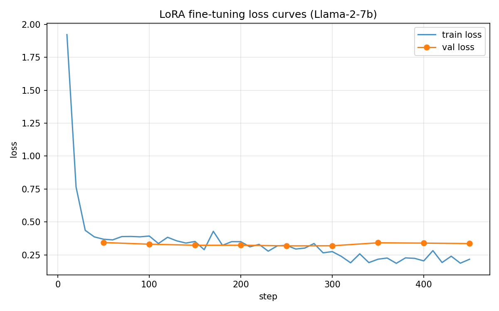
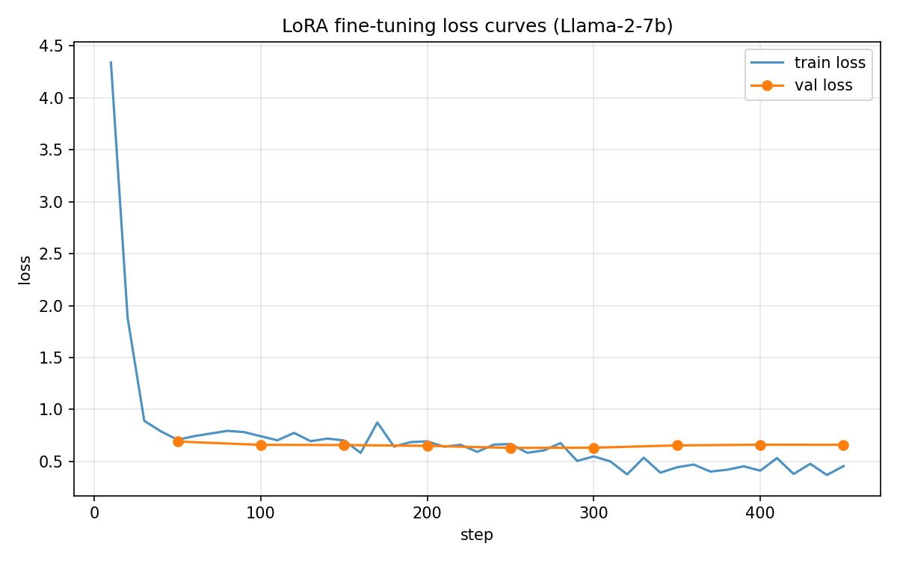

# Fine-tuning Llama 2-7B with LoRA

**Student:** 50012431 JiaqiLI
**Course:** AIAA 4051 Introduction to NLP, Spring 2026
**Date:** April 2026

---

## 1. Introduction

In this project, I fine-tuned the Llama 2-7B model on a science question answering dataset using LoRA (Low-Rank Adaptation) via the PEFT library. The goal was to train the model to generate correct answers to science-related questions. I conducted four rounds of experiments with different hyperparameter configurations and prompt templates, progressively improving the model's performance through systematic analysis of loss curves and error patterns.

## 2. Dataset

### 2.1 Overview

The provided dataset (`dataset.json`) contains 5000 science QA samples. Each sample has two fields:

- `question`: a science-related question in English (e.g., *"What is the first stage of cellular respiration?"*)
- `correct_answer`: a short factoid answer (e.g., *"glycolysis"*)

The questions span a wide range of topics including biology, chemistry, physics, and earth science. The answers are typically 1–3 words long, with an average of 11 characters.

### 2.2 Data Cleaning

Before splitting, I inspected the dataset for duplicates and found **17 question texts that appear twice** (34 rows total, 0.68% of the dataset):

- **11 groups** are exact duplicates (identical question and answer), likely artifacts of the data collection process.
- **6 groups** share the same question but have minor answer variations (e.g., `cecum` vs `the cecum`, `atoms` vs `atom`).

I deduplicated by question text, keeping the first occurrence, leaving **4983 unique samples**.

### 2.3 Train/Val Split

I split the deduplicated dataset into a training set and a validation set with a 90/10 ratio using a fixed random seed (seed=42) for reproducibility:

- **Training set:** 4484 samples
- **Validation set:** 499 samples

I verified that no question text appears in both splits (overlap = 0).

## 3. Model Setup

### 3.1 Base Model

I used the Llama 2-7B base model, downloaded from ModelScope.

### 3.2 LoRA Configuration

I applied LoRA adapters to the four attention projection layers of the model using PEFT:

- **Target modules:** `q_proj`, `k_proj`, `v_proj`, `o_proj`
- **Bias:** none
- **Task type:** CAUSAL_LM

The LoRA-specific hyperparameters (rank, alpha, dropout) were varied across experiments, as detailed in Section 5.

### 3.3 Training Setup

All training was conducted on a single NVIDIA RTX A6000 GPU (48GB VRAM) with the following fixed settings:

| Parameter | Value |
|---|---|
| LR scheduler | cosine with warmup |
| Warmup ratio | 0.03 |
| Weight decay | 0.0 |
| Per-device train batch size | 4 |
| Gradient accumulation steps | 4 |
| Effective batch size | 16 |
| Max sequence length | 256 |

### 3.4 Prompt Template

I experimented with two prompt templates during training:

**Template A (bare answer):**
```
Question: {question}
Answer: {answer}<eos>
```

**Template B (structured answer):**
```
Question: {question}
Answer: The answer is {answer}.<eos>
```

During training, the loss was computed **only on the answer tokens** — the question/prompt tokens were masked with `ignore_index=-100` to ensure the model learned to generate answers rather than memorize questions.

## 4. Evaluation

### 4.1 Accuracy Metric

Following the course specification, accuracy is defined as:

> accuracy = (number of times the correct answer appears in the generated response) / (total number of questions)

Concretely, for each question, I generated a response using greedy decoding (`do_sample=False`, `max_new_tokens=32`) and checked whether `correct_answer.lower()` appears as a substring in the generated text (converted to lowercase).

### 4.2 Evaluation Procedure

After training, I loaded the base Llama 2-7B model together with the saved LoRA adapter using `PeftModel.from_pretrained()`, and ran generation on both the training set and the validation set. For each sample, I recorded the generated text and compared it against the gold answer using the substring match described above.

## 5. Experiments and Results

I conducted 4 rounds of training, each informed by the analysis of the previous round.

### 5.1 Round 1 — Baseline

**Configuration:**

| Parameter | Value |
|---|---|
| LoRA rank (r) | 8 |
| LoRA alpha | 16 |
| LoRA dropout | 0.05 |
| Trainable params | 8,388,608 (0.12%) |
| Epochs | 3 |
| Learning rate | 2e-4 |
| Prompt template | Template A (bare) |

**Results:**

| Metric | Value |
|---|---|
| Train accuracy | 62.1% |
| Val accuracy | 49.5% |
| Final train loss | ~0.25 |
| Final val loss | ~0.75 |

**Loss Curve:**


**Analysis:**

The training loss decreased steadily from 4.6 to ~0.25, but the validation loss plateaued at ~0.65 by step 200 and then gradually increased to ~0.75. This indicated severe overfitting.

I also examined the generated answers on the validation set and found that many errors fell into a specific pattern: the model produced a shorter but semantically correct answer that failed the substring check. For example, the model generated `charge` when the gold answer was `electric charge`. Since the metric checks whether the gold answer appears *in* the prediction (not the other way around), a shorter prediction always fails when the gold is longer.

### 5.2 Round 2 — Fixing Overfitting + Prompt Engineering

Based on the Round 1 analysis, I made several changes to address overfitting and the substring matching issue.

**Changes:**

| Parameter | Round 1 | Round 2 |
|---|---|---|
| Prompt template | Template A (bare) | **Template B (structured)** |
| Epochs | 3 | **2** |
| LoRA rank (r) | 8 | **16** |
| LoRA alpha | 16 | **32** |
| LoRA dropout | 0.05 | **0.1** |
| Learning rate | 2e-4 | **1e-4** |

The prompt template was changed to `The answer is {a}.` to encourage longer predictions that would be more likely to contain the gold answer as a substring.

**Results:**

| Metric | Round 1 | Round 2 |
|---|---|---|
| Train accuracy | 62.1% | 61.3% |
| Val accuracy | 49.5% | **51.1%** |
| Final train loss | ~0.25 | ~0.27 |
| Final val loss | ~0.75 | **~0.325** |

**Loss Curve:**


**Analysis:**

The results were mixed. On one hand, the overfitting was completely eliminated — val loss dropped from 0.75 to 0.325 and remained flat throughout training. The train/val loss gap shrank from 0.50 to just 0.05. On the other hand, the accuracy improvement was modest (+1.6% on val).

Looking at the generated answers, I found that the model now consistently outputted `The answer is ...` format, but the core answer content was unchanged. For instance, the model still generated `The answer is charge.` instead of `The answer is electric charge.` The template wrapper did not change what the model "knew" — it only changed the formatting.

### 5.3 Round 3 — Larger Capacity + Early Stopping

Since the val loss was still flat at 0.325 at the end of Round 2, I hypothesized that there was room for more training. I also increased the LoRA rank to give the model more capacity.

**Changes:**

| Parameter | Round 2 | Round 3 |
|---|---|---|
| LoRA rank (r) | 16 | **32** |
| LoRA alpha | 32 | **64** |
| Epochs | 2 | **3 + early stopping (patience=3)** |

**Results:**

| Metric | Round 2 | Round 3 |
|---|---|---|
| Train accuracy | 61.3% | **66.6%** |
| Val accuracy | 51.1% | **52.7%** |
| Best val loss | 0.325 | 0.336 |
| Stopped at | epoch 2.0 | **epoch 1.61 (early stopped)** |

**Loss Curve:**



**Analysis:**

Early stopping triggered at epoch 1.61 (step 450 of 840). The val loss was flat from step 50 onward (~0.33–0.34), confirming that the model reached its generalization ceiling quickly. Doubling the LoRA rank from 16 to 32 helped the model memorize more training data (train accuracy jumped from 61% to 67%), but this did not translate proportionally to better validation performance (+1.6%).

At this point, I concluded that the **dataset size (4983 samples) was the primary bottleneck**, not model capacity or training duration. The model had already extracted most of the learnable patterns from the data within ~1.5 epochs.

### 5.4 Round 4 — Template Ablation Study

To verify whether the `The answer is` template was genuinely helping, I ran an ablation experiment: reverting to the bare answer template while keeping all other Round 3 settings.

**Changes:**

| Parameter | Round 3 | Round 4 |
|---|---|---|
| Prompt template | Template B (structured) | **Template A (bare)** |
| Epochs | 3 + early stopping | **2 + early stopping** |

**Results:**

| Metric | Round 3 | Round 4 |
|---|---|---|
| Train accuracy | 66.6% | 64.4% |
| Val accuracy | **52.7%** | 50.9% |
| Best val loss | 0.336 | 0.655 |

**Loss Curve:**



**Analysis:**

All metrics dropped. The val loss nearly doubled (0.336 → 0.655), and accuracy decreased by 1.8%. This confirmed that the `The answer is` template provides a structured output format that helps the model focus its capacity on the answer content rather than output formatting. Removing it forces the model to "decide" its output format from scratch, wasting capacity and producing less accurate answers.

### 5.5 Summary of All Rounds

| Metric | Round 1 | Round 2 | Round 3 (best) | Round 4 |
|---|---|---|---|---|
| LoRA rank | 8 | 16 | **32** | 32 |
| LoRA alpha | 16 | 32 | **64** | 64 |
| LoRA dropout | 0.05 | 0.1 | **0.1** | 0.1 |
| Epochs (actual) | 3 | 2 | **1.61** | 1.61 |
| Learning rate | 2e-4 | 1e-4 | **1e-4** | 1e-4 |
| Prompt template | bare | structured | **structured** | bare |
| Train accuracy | 62.1% | 61.3% | **66.6%** | 64.4% |
| Val accuracy | 49.5% | 51.1% | **52.7%** | 50.9% |
| Best val loss | 0.65 | 0.325 | **0.336** | 0.655 |
| Overfitting | severe | none | **none** | none |

## 6. Final Model

Based on the experiments above, I selected the **Round 3 configuration** as the final model for submission, as it achieved the highest validation accuracy (52.7%) with no overfitting.

**Final model hyperparameters:**

| Parameter | Value |
|---|---|
| LoRA rank (r) | 32 |
| LoRA alpha | 64 |
| LoRA dropout | 0.1 |
| Target modules | q_proj, k_proj, v_proj, o_proj |
| Trainable parameters | ~33.6M (0.50% of 6.74B) |
| Epochs (actual) | 1.61 (early stopped) |
| Learning rate | 1e-4 |
| LR scheduler | cosine |
| Warmup ratio | 0.03 |
| Effective batch size | 16 |
| Precision | bf16 |
| Prompt template | `Question: {q}\nAnswer: The answer is {a}.<eos>` |

**Final accuracy:**

| Set | Accuracy |
|---|---|
| Training set | 66.6% (2988 / 4484) |
| Validation set | **52.7%** (263 / 499) |

## 7. Key Takeaways

1. **Regularization matters most.** Fixing overfitting (lower LR, higher dropout, fewer epochs) gave the biggest single improvement.
2. **Prompt template helps.** The `The answer is` format reduced val loss by 50% and improved accuracy, confirmed by the Round 4 ablation.
3. **Dataset size is the bottleneck.** With ~5000 samples, the model plateaus within ~1.5 epochs. Increasing LoRA rank helped train accuracy but barely improved validation.
4. **Early stopping prevents waste.** It consistently stopped at epoch 1.61, avoiding unnecessary overfitting on this small dataset.
